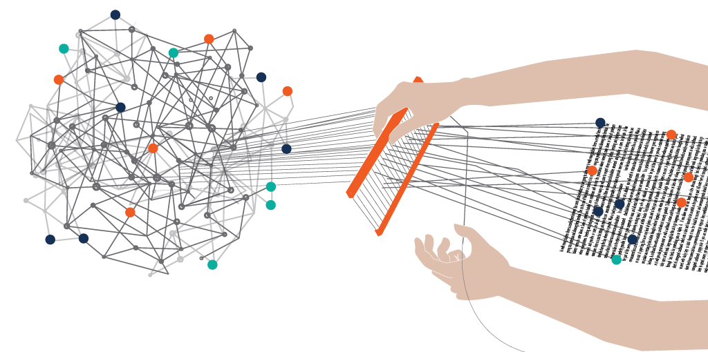
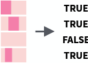
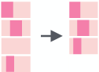
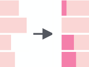
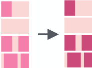
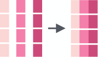
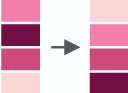
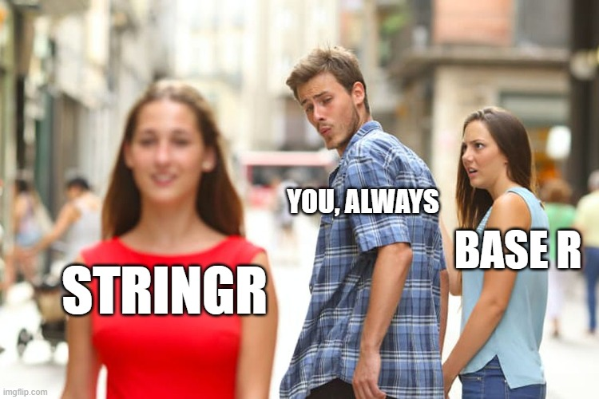
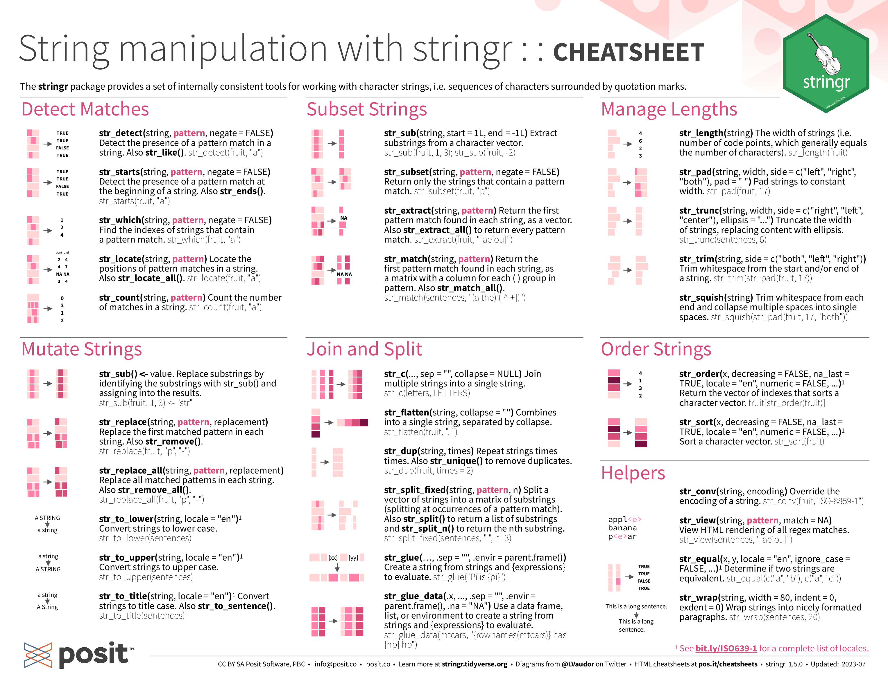
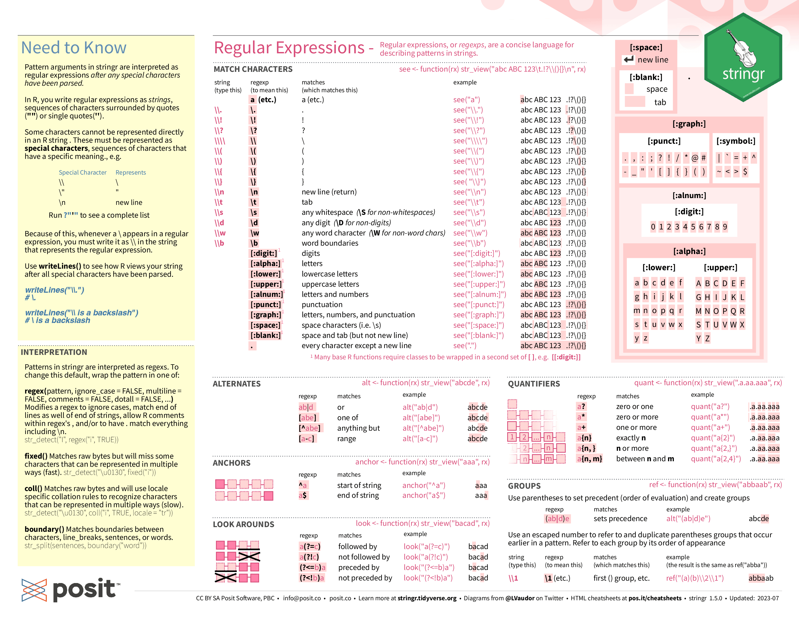

```{r setup, include=FALSE}
options(htmltools.dir.version = FALSE)
```

# Our Aim for Today

--

1. String Recap, Text data

--

1. stringr and stringi

--

1. stringr deepdive

--

1. stringr and Regular expression

--

1. Reasons to use stringi

--

1. Further Resources

---
# Text data in social science research



--

WZB conducting research on [party manifestos](https://wzb.eu/de/forschung/werkstatt-wahlen-am-wzb/manifesto-monday).

--

GESIS projects on text [data mining](https://www.gesis.org/en/research/applied-computer-science/text-and-data-mining).

--

Twitter [research projects](https://arxiv.org/abs/2301.11429).

--

Hertie students scraping all Bundestag speeches, crashing the website (allegedly!).


---
class: inverse, center, middle

# What's a string?

---

# Quick Recap: What's a string?

We use strings to present text data:
--

```{r eval=FALSE, tidy=FALSE}
string <- "Text Data"
```
A very literal, yet true example.

--

Strings are made up of characters, defined via single or double quotes and contain any text you want: 


--

We can also store multiple strings in a vector:
```{r eval=FALSE, tidy=FALSE}
c("Strings", "are", "great")
#> [1] "Strings"   "are"   "great"
```
Using tools like `grep()` and Regular Expressions, we can do a lot of string manipulation.

---

# So, I handle strings in base R then?

--

--


Base R can be way too challenging in handling strings, especially on a larger scale:
--


We all know (and love) Regular Expressions, which is why we all immediately know what this line does:
--


```{r eval=FALSE, tidy=FALSE}
gsub("\\.[a-zA-Z]{2,}$", "", gsub("^.+@", "", emails[grep("[a-zA-Z0-9._%+-]+@[a-zA-Z0-9.-]+\\.[a-zA-Z]{2,}", emails)]))
```
--

Great, me too! We can **quickly** see, this gsub intends to extract the domain of valid email addresses from a given input vector of strings:
```{r eval=FALSE, tidy=FALSE}
emails <- c("jackson@MacBook", "jackson@students.hertie-school.org", "jackson", "jacksonmluckey@gmail.com", "lazy dog", "jackson@icloud.com")
```

---
# stringr | stringi
This is where our packages enter the game.

--

.pull-left[


- Part of the tidyverse, very intuitive use.

- Delivers many basic functions to extract, manipulate, subset, measure etc. string data.

- Easily identifiable via `str_`.

- Built on top of `stringi`.
]

--

.pull-right[


- More configurable and more than `stringr`.

- Can handle more complex tasks.

- Better for locale-specific conditions, such as language or time.

- Generally starts with `stri_`.
]
---
#stringr deep-dive

.pull-left[


We can use `str_detect()` to identify patterns.

**Example**: In academic research, you might want to extract references or citations from a body of text for further analysis. Detecting and extracting patterns like DOI (Digital Object Identifier) or citation styles can be crucial.




Use `str_subset()` on a user-defined pattern.

**Example**: When working with survey data, you might want to extract specific responses or categories from open-ended questions.
]

.pull-right[


Use `str_pad()` if you want to pad strings to a consistent length.

**Example**: You're working on a sentiment analysis project, using a bag-of-words approach to convert text data into numerical features.



`str_replace()` to replace all matched patterns in a string.

**Example**: You're analyzing a dataset of tweets or social media posts, and you want to anonymize certain information, such as usernames or email addresses for privacy reasons.
]
---
#Stringr deep-dive __||__


`str_c()` to join multiple strings into one.

**Example**: You've finalized a data analysis project and want to generate a report that includes text descriptions along with dynamically generated values from your analysis.

--



`str_sort()` to sort strings alphabetically.

**Example**: You're working on a project, using a data set with categorical variables, such as product categories or similar. You want to sort the categories alphabetically for better visualization and analysis.

---
#Stringr and Regular Expressions

The power of `stringr` comes alive when **combined** with Regular Expressions.

--

```{r eval=FALSE, tidy=FALSE}
string <- "It's not a bug – it's a feature."
str_extract_all(string, "\\b\\w+\\b")
[1] "It"      "s"       "not"     "a"       "bug"     "it"     
[7] "s"       "a"       "feature"
```
This is very useful in Tokenized Natural Language Processing. Extracting single strings to separate between 'filler words' and those relevant to the research question.

--

For all text analyses projects, we have to clean the data to a certain extent, combining `stringr` and Regular Expressions can serve a great purpose, for example in standardizing data.

--

```{r eval=FALSE, tidy=FALSE}
replacements <- c("USA" = "United States", "UK" = "United Kingdom")
data$text_column <- str_replace_all(data$text_column, replacements)
```


---
#Reasons to use stringi

--

`stringi` has extensive support for [Unicode](https://home.unicode.org/), which makes it suitable for text-processing in basically any language.

--

It can switch between different locales, which is important when handling internationally sourced data.

--

`stringi` is the package `stringr` is built on top of and is highly specific in its use-cases.

If you cannot find a way to do the specific manipulation that you want to with `stringr` consider some additional [stringi resources](https://www.rdocumentation.org/packages/stringi/versions/1.7.12).

--

However, for most of your everyday string-manipulation and data cleaning tasks, we recommend using `stringr`, as it's more intuitive ans straight forward.



---
#Further Resources
.pull-left[

]

.pull-right[

]

Test your RegEx knowledge [here](https://regex101.com/).

Additional Resources on RegEx and general [String Manipulation](https://github.com/ziishaned/learn-regex) and [specific classes.](https://www.dataquest.io/course/r-data-cleaning-advanced/)

---
Image Credits:

- [String Example](https://upload.wikimedia.org/wikipedia/commons/6/6b/String_example.png)

- [Well Yes, but actually No](https://en.meming.world/images/en/f/f7/Well_Yes%2C_But_Actually_No.jpg)

- [Text Data](https://www.ontotext.com/blog/text-mining-graph-databases-work-well-together/)

- [Stringr logo](https://stringr.tidyverse.org/)

- [Stringi logo](https://www.gagolewski.com/software.html)

- [Stringr Cheatsheet](https://github.com/rstudio/cheatsheets/blob/main/strings.pdf)


